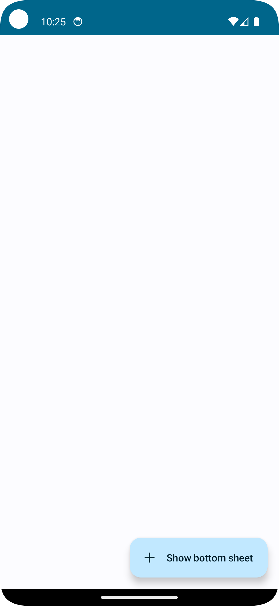

## Components Description

## Switch
- A toggle switch component scaled to 75% of its original size.
## Card
- Material design card with rounded corners and elevation.
## Text
- Displays static text with various styles (bold, semi-bold).
## Divider
- Horizontal line to visually separate content.
## AssistChip
- Chip component with customizable colors.
## Buttons
- Basic, Elevated, Outlined, and Text styled buttons.
## Slider
- Allows users to select a value from a range.
## FloatingActionButton
- Circular button with an icon for primary actions.

## Preview

---
## Scaffold
Implementation of a scaffold layout using `Scaffold` in Jetpack Compose.

### Preview:

## Bottomsheet
Implementation of a bottom sheet using `ModalBottomSheetLayout` in Jetpack Compose.

### Preview:
  

## Dialog
Implementation of a dialog using `AlertDialog` in Jetpack Compose.

### Preview:
  

## TextField
Implementation of a text field using `OutlinedTextField` in Jetpack Compose.

### Preview:

