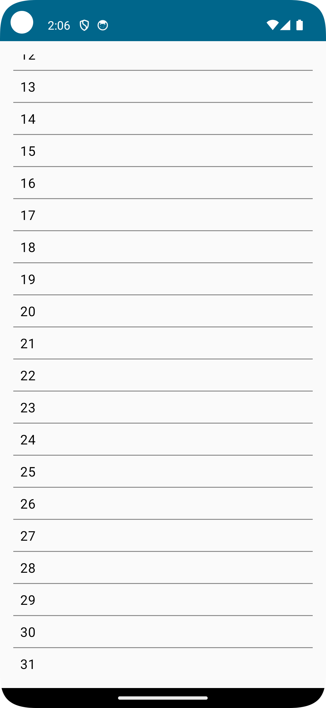
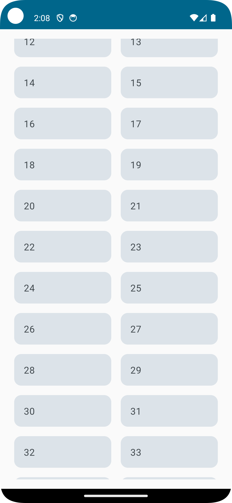

# Lazy Loading in Jetpack Compose

## Lazy Column and Lazy Row

Compose provides a set of components that handle lazy loading efficiently by only composing and laying out items that are visible in the component’s viewport.

### Lazy Column

- Displays items in a vertically scrolling list.

### Lazy Row

- Displays items in a horizontally scrolling list.

## Lazy Grids

Compose also supports grid layouts with lazy loading capabilities.

### Lazy Vertical Grid

- Displays items in a vertically scrollable grid layout.
- Uses `LazyVerticalGrid`, which arranges items across multiple columns within a vertical scrollable container.

### Lazy Horizontal Grid

- Displays items in a horizontally scrollable grid layout.
- Utilizes `LazyHorizontalGrid`, arranging items across multiple rows within a horizontal scrollable container.

### Preview of Lazy Lists and LazyVerticalGrids:
       
