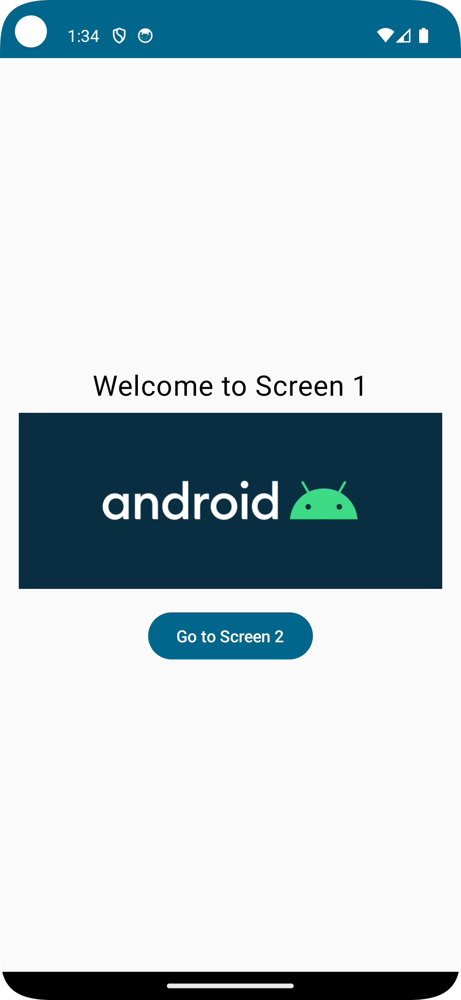
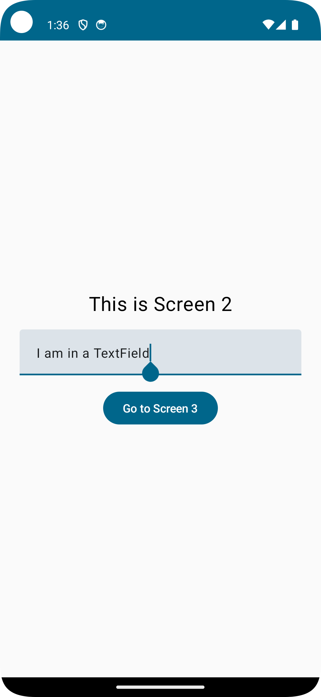
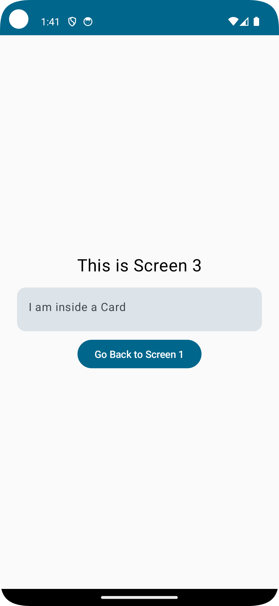

## Navigation in Jetpack Compose

### NavController
`NavController` is the central API for navigation in Jetpack Compose. It provides methods for navigating between composable destinations and managing the back stack.

### NavHost
`NavHost` links the `NavController` with a navigation graph, defining composable destinations. It serves as the container for managing the navigation.

### Description
In this example, we created a simple navigation system with three screens using `NavController` and `NavHost`.

- **Screen1**: Displays a welcome message and an image. Contains a button that navigates to Screen 2.
- **Screen2**: Contains a text field for user input and a button that navigates to Screen 3.
- **Screen3**: Displays a card with a message inside it and a button that navigates back to Screen 1

### Preview:
  

